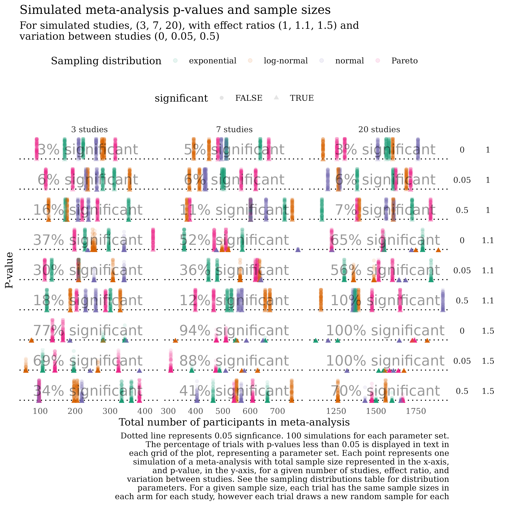

<!-- README.md is generated from README.Rmd. Please edit that file -->

```{r set up, echo = FALSE}
knitr::opts_chunk$set(
  cache = TRUE,
  eval = TRUE,
  collapse = TRUE,
  comment = "#>",
  fig.path = "README-"
)
```

<!-- badges: start -->
<!-- [](https://travis-ci.org/softloud/simeta) -->
<!-- badges: end -->

# [`simeta`](https://softloud.github.io/simeta/)  

(*Thank you [@anatomecha](https://github.com/anatomecha/) for the sweet hex sticker*)

The goal of `simeta` is to simulate meta-analysis data. 

These are a sometimes-useful modular set of tools for simulating meta-anlaysis data I mostly developed during my doctoral project. 

In particular, I'm often interested in simulating meta-analysis data for different values of 

- $k$, number of studies
- $\tau^2$, variation between studies
- $\varepsilon^2$, variation within a study
- numbers of trials, say 10, 100, 1000
- distributions, _and_ parameters; e.g., $\exp(\lambda = 1)$ and $\exp(\lambda = 2)$. 


```{r fig.height=10,fig.cap="Example simulation study"}
# example simulation using simeta



```

This readme is not comprehensive, but updated as collaborators need scripts and examples.   

## installation

You can install `simeta` from github with:

```{r gh-installation, eval = FALSE}
# install.packages("devtools")
devtools::install_github("softloud/simeta")
```


## examples

```{r packages, message=FALSE}
# packages
library(simeta)
library(tidyverse)
library(knitr)
library(metafor)

# so these results are reproducible
set.seed(306) 

```


## simulate meta-analysis data 

Suppose we are interested in comparing how variation between studies and overall sample size influence the likelihood of significance in meta-analyses with small to large effects. 


### set simulation-level parameters


```{r}
# set default parameters, useful to store as an object for visualisation 
# labelling

# set effect ratios of interest
sim_effect_ratio <- c(1, 1.5)
# set desired variance between studies
sim_tau_sq <- c(0, 0.2)
# set minimum sample size per study
sim_min_n <- 5
# set maximum sample size per study
sim_max_n <- 150

```

Use `sim_df` to set up a dataframe of simulation parameters, wherein every row represents one combination of simulation parameters.

```{r}

# see ?sim_df to see what other things can be specified

sim_parameters <- sim_df(
  # choose three default distributions to sample from to keep example small
  dist_df = default_parameters %>% sample_n(3),
  tau_sq = sim_tau_sq,
  effect_ratio = sim_effect_ratio,
  min_n = sim_min_n,
  max_n = sim_max_n
)

```

### Generate samples

Use `sim_samples` to create a dataframe where each row of the simulation parameter level dataframe is repeated `trials` times, and a new list-column of meta-analysis samples are generated using the row-level simulation parameters. 

```{r}
# Generate simulated meta-analyses from simulation parameters dataframe
# Number of trials represents number of repeated rows per simulation parameter
# set

samples_df <- 
  sim_samples(
  measure = "mean",
  measure_spread = "sd",
  sim_dat = sim_parameters,
  # small for the purposes of example
  trials = 3
)

# take a look at a few rows
samples_df %>% sample_n(5)

```


```{r}
# example simulated meta-analysis dataset 
samples_df %>% sample_n(1) %>% pluck("sample") %>% kable()
```

### Meta-analyse each sample


```{r}
# Generate meta-anlyses and extract a parameter of interest, such as p-value.
sim_metafor <-
  samples_df %>%
  # making small for purposes of example (simulations scale fast!)
  sample_n(20) %>% 
  mutate(
    rma = map(sample,
      function(x) {
        metafor::rma(data = x,
          measure = "SMD",
          m1i = effect_c,
          sd1i = effect_spread_c,
          n1i = n_c,
          m2i = effect_i,
          sd2i = effect_spread_i,
          n2i = n_i
            )}

      )
  ) %>%
  # extract pvalues
  mutate(
    p_val = map_dbl(rma, pluck, "pval")
  )

# take a look
sim_metafor %>% mutate(p_val = round(p_val, 2)) %>% select(p_val, everything())

```

## Caching with targets

I find I run into problems very quickly with memory. 
The `targets` package can help. For example, the following example samples from several distributions, each with different parameter sets. This combinatorially increases the number of simulations.

```{r}
default_parameters %>% 
  kable(digits = 2)
```


See _targets.R for an example script that
produces this visualisation adapting the workflow above. Each point in this plot represents one p-value from a meta-analysis on a randomly-generated dataset.


```{r fig.height=10}


```


### Some details

Without specification, the function uses the default parameters dataset (`?default_parameters`). 

```{r}
default_parameters %>% kable()

```

This dataset also provides a template for how to set up a dataframe specifying the distributions and parameters of interest for `sim_df`. The default sampling distributions are designed to provide a mix of common symmetric and asymmetric families, with both fixed and randomly-generated parameters.


```{r}
sim_dat <-
  # defaults to using default_parameters if we do not specify dist_df argument
  sim_df(
  # different effect sizes
  # what is small, medium large effect
  effect_ratio = sim_effect_ratio,
  # what is small medium large variance
  tau_sq = sim_tau_sq,
  min_n = sim_min_n,
  max_n = sim_max_n
)


```

```{r}

# take a look at the top of the dataset
sim_dat %>% head(3) 

# the end of the dataset
sim_dat %>% tail(3) 

# take a look at a random handful of rows
sim_dat %>% sample_n(5)

```

`sim_df` uses `sim_n` as explained below to create each dataset of sample sizes. 

### simulate paired sample sizes


This is a function I have often wished I've had on hand when simulating meta-analysis data. Thing is, running, say, 1000 simulations, I want to do this for the _same_ sample sizes. So, I need to generate the sample sizes for each study and for each group (control or intervention).   

Given a specific $k$, generate a set of sample sizes. 

```{r different k}

# defaults to k = 3
sim_n() %>% kable()

sim_n(k = 3) %>% kable()

# set k to a different value

sim_n(k = 6) %>% kable()


```

<!-- Suppose we require data that mimics small cohorts, say as small as 3, and as large as 50.  -->

```{r small cohort}
# control upper and lower bounds
sim_n(min_n = 3, max_n = 50) %>% kable()
 
```

We expect cohorts from the same study to have roughly the same size, proportional to that size. We can control this proportion with the `prop` argument.

Suppose we wish to mimic data for which the cohorts are almost exactly the same (say becaues of classes of undergrads being split in half and accounting for dropouts).

```{r prop}
# small variation between sample sizes of studies
sim_n(k = 2, prop = 0.05, max_n = 50) %>% kable()

```

It can be useful, for more human-interpretable purposes, to display the sample sizes in wide format. 

### simulation parameters

Adding a few values of $\tau$, different numbers of studies $k$, and so forth can ramp up the number of combinations of simulation parameters very quickly.  

I haven't settled on a _way_ of simulating data, and haven't found heaps in the way of guidance yet. So, this is all a bit experimental. My guiding star is packaging what I'd use right now. 

What I do always end up with is generating a dataset that summarises what I would like to iterate over in simulation. 

The `sim_df` takes user inputs for distributions, numbers of studies, between-study error $\tau$, within-study error $\varepsilon$, and the proportion $\rho$ of sample size we expect the sample sizes to different within study cohorts.

```{r sim overview}
# defaults
sim_df() 

sim_df() %>% str(1)

# only consider small values of k
sim_df(k = c(2, 5, 7)) %>% str(1)
```

For the list-column of tibbles `n`, the `sim_df` function calls `sim_n` and generates a set of sample sizes based on the value in the column `k`.

```{r sample sizes set}
demo_k <- sim_df() 

# the variable n is a list-column of tibbles
demo_k %>% pluck("n") %>% head(3)


# compare the number of rows in the dataframe in the n column with the k value
# divide by two because there are two rows for each study,
# one for each group, control and intervention
demo_k %>% pluck("n") %>% map_int(nrow) %>% head(3) / 2
demo_k %>% pluck("k") %>% head(3)

```


## simulating data

Once we have established a set of sample sizes for a given distribution, with parameters, and so forth, I usually want to generate a sample for each of those `n`. We need to adjust the value of the sampled data based on the median ratio, and whether the `n` is from a control or intervention group.

A random effect is added to account for the between study error $\tau$ and within study error $\varepsilon$. 

For meta-analysis data, we work with summmary statistics, so we drop the sample and return tabulated summary stats. 

```{r simulate a sample}
sim_stats()  %>% kable()
```


# Archived PhD work (see [phd-scripts/](TODO link to GITHUB archive dir))

## trial

In a trial, we'd first want to simulate some data, for a given distribution, for this we use the `sim_stats` function discussed in the above section. 

With the summary statistics, we then calculate an estimate of the effect or the variance of the effect. 

1. simulate data
2. calculate summary statistics
3. **calculate estimates using summary statistics**
4. calculate effects using estimates (difference, standardised, log-ratio)[^1]
5. meta-analyse 
6. return simulation results of interest

[^1]: Ideally this would be configurable but let's hardcode it for now. 


The first two steps are taken care of by the `sim_stats` function. The third step will by necessity be bespoke. 

But the rest could be automated, assuming there are the same kinds of results. 

step | input | output |
-|-|-
calculate estimates | summary statistics as produced by `sim_n` | summary stats
calculate effects | summary stats | `effect` and `effect_se`
meta-analyse | `effect` and `effect_se` | `rma` object 
summary stats | `rma` object | some kind of `broom`ing script

```{r eval=FALSE}
metatrial()
```

## summarising simulation results

So, now we can put together some generic summarisations. Things I always want to do. Like calculate the coverage probability, confidence interval width, and bias. Most results here are mean values across all trials, the exceptions being `cp_` variables.  

`metasim` calls `metatrial` many times and summarises the results.

```{r eval=FALSE}
metasim()
```

## simulate over parameters

```{r eval=FALSE}
(sim <- metasims())
```


## visualise

```{r coverage, eval=FALSE}
sim %>% coverage_plot()
```


