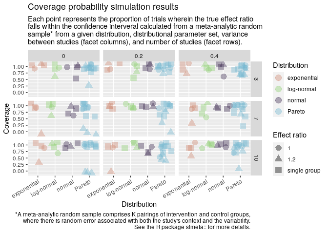

<!-- README.md is generated from README.Rmd. Please edit that file -->

<!-- badges: start -->

[](https://travis-ci.org/softloud/simeta)
<!-- badges: end -->

# `simeta::`

The goal of `simeta::` is to simulate meta-analysis data.

I found I was rewriting the same types of analyses. How to make a
modular set of tools for simulating meta-anlaysis data.

In particular, I’m interested in simulating for different values of

  - \(k\), number of studies
  - \(\tau^2\), variation between studies
  - \(\varepsilon^2\), variation within a study
  - numbers of trials, say 10, 100, 1000
  - distributions, *and* parameters; e.g., \(\exp(\lambda = 1)\) and
    \(\exp(\lambda = 2)\).

## work in progress

This package is a work in progress, can’t guarantee anything works as
intended.

## installation

You can install `simeta::` from github with:

``` r
# install.packages("devtools")
devtools::install_github("softloud/simeta")
```

## examples

### simulate paired sample sizes

``` r
# packages
library(simeta)
library(tidyverse)

# so these results are reproducible
set.seed(39) 
```

This is a function I have often wished I’ve had on hand when simulating
meta-analysis data. Thing is, running, say, 1000 simulations, I want to
do this for the *same* sample sizes. So, I need to generate the sample
sizes for each study and for each group (control or intervention).

Given a specific \(k\), generate a set of sample sizes.

``` r

# defaults to k = 3
sim_n() %>% knitr::kable()
```

| study    | group        |  n |
| :------- | :----------- | -: |
| study\_1 | control      | 31 |
| study\_2 | control      | 14 |
| study\_3 | control      | 59 |
| study\_1 | intervention | 29 |
| study\_2 | intervention | 13 |
| study\_3 | intervention | 64 |

``` r

sim_n(k = 3) %>% knitr::kable()
```

| study    | group        |   n |
| :------- | :----------- | --: |
| study\_1 | control      |  93 |
| study\_2 | control      |  44 |
| study\_3 | control      |  89 |
| study\_1 | intervention |  84 |
| study\_2 | intervention |  49 |
| study\_3 | intervention | 103 |

``` r

# set k to a different value

sim_n(k = 6) %>% knitr::kable()
```

| study    | group        |  n |
| :------- | :----------- | -: |
| study\_1 | control      | 93 |
| study\_2 | control      | 55 |
| study\_3 | control      | 41 |
| study\_4 | control      | 90 |
| study\_5 | control      | 95 |
| study\_6 | control      | 66 |
| study\_1 | intervention | 87 |
| study\_2 | intervention | 55 |
| study\_3 | intervention | 45 |
| study\_4 | intervention | 92 |
| study\_5 | intervention | 92 |
| study\_6 | intervention | 52 |

Suppose we require data that mimics small cohorts, say as small as 3,
and as large as 50.

``` r
# control upper and lower bounds
sim_n(min_n = 3, max_n = 50) %>% knitr::kable()
```

| study    | group        |  n |
| :------- | :----------- | -: |
| study\_1 | control      |  6 |
| study\_2 | control      |  6 |
| study\_3 | control      | 12 |
| study\_1 | intervention |  5 |
| study\_2 | intervention |  6 |
| study\_3 | intervention | 15 |

We expect cohorts from the same study to have roughly the same size,
proportional to that size. We can control this proportion with the
`prop` argument.

Suppose we wish to mimic data for which the cohorts are almost exactly
the same (say becaues of classes of undergrads being split in half and
accounting for dropouts).

``` r
# small variation between sample sizes of studies
sim_n(k = 2, prop = 0.05, max_n = 50) %>% knitr::kable()
```

| study    | group        |  n |
| :------- | :----------- | -: |
| study\_1 | control      | 26 |
| study\_2 | control      | 38 |
| study\_1 | intervention |  1 |
| study\_2 | intervention |  0 |

It can be useful, for more human-interpretable purposes, to display the
sample sizes in wide format.

This is also useful for calculations that convert two measures to one,
say, the standardised mean difference of the control and intervention
groups.

Consider four classrooms of children, who may have one or two away for
illness.

``` r
sim_n(k = 4, prop = 0.05, max_n = 30, wide = TRUE) %>%
  # from here I'm just relabelling the class variable for prettiness
  separate(study, into = c("remove", "class"), sep = "_") %>% 
  select(-remove) %>% 
  mutate(class = letters[as.numeric(class)]) %>% knitr::kable()
```

| class | intervention | control |
| :---- | -----------: | ------: |
| a     |            0 |      22 |
| b     |            0 |      21 |
| c     |            0 |      25 |
| d     |            0 |      24 |

### simulation parameters

Adding a few values of \(\tau\), different numbers of studies \(k\), and
so forth can ramp up the number of combinations of simulation parameters
very quickly.

I haven’t settled on a *way* of simulating data, and haven’t found heaps
in the way of guidance yet. So, this is all a bit experimental. My
guiding star is packaging what I’d use right now.

What I do always end up with is generating a dataset that summarises
what I would like to iterate over in simulation.

The `sim_df` takes user inputs for distributions, numbers of studies,
between-study error \(\tau\), within-study error \(\varepsilon\), and
the proportion \(\rho\) of sample size we expect the sample sizes to
different within study cohorts.

``` r
# defaults
sim_df() 
#> # A tibble: 108 x 8
#>        k tau_sq_true effect_ratio rdist  parameters   n        id    true_effect
#>    <dbl>       <dbl>        <dbl> <chr>  <list>       <list>   <chr>       <dbl>
#>  1     3           0            1 norm   <named list… <tibble… sim_1       2    
#>  2     3           0            1 exp    <named list… <tibble… sim_2       0.347
#>  3     3           0            1 pareto <named list… <tibble… sim_3       0.780
#>  4     3           0            1 pareto <named list… <tibble… sim_4       0.414
#>  5     3           0            1 pareto <named list… <tibble… sim_5       3    
#>  6     3           0            1 lnorm  <named list… <tibble… sim_6       2.72 
#>  7     7           0            1 norm   <named list… <tibble… sim_7       2    
#>  8     7           0            1 exp    <named list… <tibble… sim_8       0.347
#>  9     7           0            1 pareto <named list… <tibble… sim_9       0.780
#> 10     7           0            1 pareto <named list… <tibble… sim_…       0.414
#> # … with 98 more rows

sim_df() %>% str(1)
#> tibble [108 × 8] (S3: tbl_df/tbl/data.frame)

# only consider small values of k
sim_df(k = c(2, 5, 7)) %>% str(1)
#> tibble [108 × 8] (S3: tbl_df/tbl/data.frame)
```

For the list-column of tibbles `n`, the `sim_df` function calls `sim_n`
and generates a set of sample sizes based on the value in the column
`k`.

``` r
demo_k <- sim_df() 

# the variable n is a list-column of tibbles
demo_k %>% pluck("n") %>% head(3)
#> [[1]]
#> # A tibble: 6 x 3
#>   study   group            n
#>   <chr>   <chr>        <dbl>
#> 1 study_1 control         86
#> 2 study_2 control         17
#> 3 study_3 control         81
#> 4 study_1 intervention    86
#> 5 study_2 intervention    19
#> 6 study_3 intervention    89
#> 
#> [[2]]
#> # A tibble: 6 x 3
#>   study   group            n
#>   <chr>   <chr>        <dbl>
#> 1 study_1 control         23
#> 2 study_2 control         30
#> 3 study_3 control         57
#> 4 study_1 intervention    23
#> 5 study_2 intervention    36
#> 6 study_3 intervention    59
#> 
#> [[3]]
#> # A tibble: 6 x 3
#>   study   group            n
#>   <chr>   <chr>        <dbl>
#> 1 study_1 control         62
#> 2 study_2 control         37
#> 3 study_3 control         76
#> 4 study_1 intervention    56
#> 5 study_2 intervention    45
#> 6 study_3 intervention    77


# compare the number of rows in the dataframe in the n column with the k value
# divide by two because there are two rows for each study,
# one for each group, control and intervention
demo_k %>% pluck("n") %>% map_int(nrow) %>% head(3) / 2
#> [1] 3 3 3
demo_k %>% pluck("k") %>% head(3)
#> [1] 3 3 3
```

## simulating data

Once we have established a set of sample sizes for a given distribution,
with parameters, and so forth, I usually want to generate a sample for
each of those `n`. We need to adjust the value of the sampled data based
on the median ratio, and whether the `n` is from a control or
intervention group.

A random effect is added to account for the between study error \(\tau\)
and within study error \(\varepsilon\).

For meta-analysis data, we work with summmary statistics, so we drop the
sample and return tabulated summary stats.

``` r
sim_stats()  %>% knitr::kable()
```

| study    | group        |   effect | effect\_spread |   n |
| :------- | :----------- | -------: | -------------: | --: |
| study\_1 | control      | 63.38346 |      0.3209470 | 105 |
| study\_1 | intervention | 47.32126 |      0.3023392 |  93 |
| study\_2 | control      | 48.05826 |      0.2650456 |  26 |
| study\_2 | intervention | 62.45385 |      0.1783509 |  25 |
| study\_3 | control      | 46.24123 |      0.3056731 |  76 |
| study\_3 | intervention | 64.88732 |      0.2871718 |  91 |

## trial

In a trial, we’d first want to simulate some data, for a given
distribution, for this we use the `sim_stats` function discussed in the
above section.

With the summary statistics, we then calculate an estimate of the effect
or the variance of the effect.

1.  simulate data
2.  calculate summary statistics
3.  **calculate estimates using summary statistics**
4.  calculate effects using estimates (difference, standardised,
    log-ratio)\[1\]
5.  meta-analyse
6.  return simulation results of interest

The first two steps are taken care of by the `sim_stats` function. The
third step will by necessity be bespoke.

But the rest could be automated, assuming there are the same kinds of
results.

| step                | input                                     | output                         |
| ------------------- | ----------------------------------------- | ------------------------------ |
| calculate estimates | summary statistics as produced by `sim_n` | summary stats                  |
| calculate effects   | summary stats                             | `effect` and `effect_se`       |
| meta-analyse        | `effect` and `effect_se`                  | `rma` object                   |
| summary stats       | `rma` object                              | some kind of `broom`ing script |

``` r
metatrial()
#> Joining, by = "study"
#> # A tibble: 2 x 10
#>   measure conf_low conf_high  tau_sq     k effect true_effect coverage   bias
#>   <chr>      <dbl>     <dbl>   <dbl> <int>  <dbl>       <dbl> <lgl>     <dbl>
#> 1 median    16.9       77.6  149.        3 47.3        50     TRUE     -2.72 
#> 2 lr_med…   -0.879      1.55   0.239     3  0.335       0.182 TRUE      0.153
#> # … with 1 more variable: scaled_bias <dbl>
```

## summarising simulation results

So, now we can put together some generic summarisations. Things I always
want to do. Like calculate the coverage probability, confidence interval
width, and bias. Most results here are mean values across all trials,
the exceptions being `cp_` variables.

`metasim` calls `metatrial` many times and summarises the results.

``` r
metasim()
#> # A tibble: 2 x 12
#>   measure  tau_sq ci_width   bias coverage_count successful_tria… coverage id   
#> * <chr>     <dbl>    <dbl>  <dbl>          <int>            <int>    <dbl> <chr>
#> 1 lr_med…   0.478     3.23 0.0452              4                4        1 simu…
#> 2 median  401.       88.6  1.31                4                4        1 simu…
#> # … with 4 more variables: errors <int>, warnings <int>, messages <int>,
#> #   result <int>
```

## simulate over parameters

``` r
(sim <- metasims())
#> 
#> performing  108  simulations of  3  trials
#> $results
#> # A tibble: 216 x 20
#>    measure  tau_sq ci_width     bias coverage_count successful_tria… coverage
#>    <chr>     <dbl>    <dbl>    <dbl>          <int>            <int>    <dbl>
#>  1 lr_med… 6.89e-4    0.202 -0.00236              3                3    1    
#>  2 median  1.98e-4    0.165  0.0271               3                3    1    
#>  3 lr_med… 6.67e-2    1.33   0.00323              3                3    1    
#>  4 median  5.13e-3    0.405 -0.00643              3                3    1    
#>  5 lr_med… 1.05e-2    0.700 -0.159                3                3    1    
#>  6 median  8.54e-3    0.687  0.134                2                3    0.667
#>  7 lr_med… 0.         1.21  -0.203                3                3    1    
#>  8 median  0.         0.329  0.0269               3                3    1    
#>  9 lr_med… 2.98e-2    2.53   0.0283               3                3    1    
#> 10 median  7.06e-1    4.70  -0.371                3                3    1    
#> # … with 206 more rows, and 13 more variables: id <chr>, errors <int>,
#> #   warnings <int>, messages <int>, result <int>, k <dbl>, tau_sq_true <dbl>,
#> #   effect_ratio <chr>, rdist <chr>, parameters <list>, n <list>,
#> #   true_effect <dbl>, sim_results <list>
#> 
#> $arguments
#> # A tibble: 16 x 2
#>    argument             value       
#>    <chr>                <named list>
#>  1 single_study         <lgl [1]>   
#>  2 measure              <chr [1]>   
#>  3 measure_spread       <chr [1]>   
#>  4 distributions        <sym>       
#>  5 k                    <language>  
#>  6 tau_sq_true          <language>  
#>  7 unequal_effect_ratio <dbl [1]>   
#>  8 min_n                <dbl [1]>   
#>  9 max_n                <dbl [1]>   
#> 10 prop                 <dbl [1]>   
#> 11 prop_error           <dbl [1]>   
#> 12 trials               <dbl [1]>   
#> 13 trial_fn             <sym>       
#> 14 beep                 <lgl [1]>   
#> 15 knha                 <lgl [1]>   
#> 16 progress             <lgl [1]>   
#> 
#> $sim_pars
#> # A tibble: 108 x 8
#>        k tau_sq_true effect_ratio rdist  parameters   n        id    true_effect
#>    <dbl>       <dbl>        <dbl> <chr>  <list>       <list>   <chr>       <dbl>
#>  1     3           0            1 norm   <named list… <tibble… sim_1       2    
#>  2     3           0            1 exp    <named list… <tibble… sim_2       0.347
#>  3     3           0            1 pareto <named list… <tibble… sim_3       0.780
#>  4     3           0            1 pareto <named list… <tibble… sim_4       0.414
#>  5     3           0            1 pareto <named list… <tibble… sim_5       3    
#>  6     3           0            1 lnorm  <named list… <tibble… sim_6       2.72 
#>  7     7           0            1 norm   <named list… <tibble… sim_7       2    
#>  8     7           0            1 exp    <named list… <tibble… sim_8       0.347
#>  9     7           0            1 pareto <named list… <tibble… sim_9       0.780
#> 10     7           0            1 pareto <named list… <tibble… sim_…       0.414
#> # … with 98 more rows
#> 
#> $distributions
#>     dist      par
#> 1   norm 2.0, 0.3
#> 2    exp        2
#> 3 pareto     3, 3
#> 4 pareto     2, 1
#> 5 pareto 0.5, 1.0
#> 6  lnorm 1.0, 0.3
#> 
#> attr(,"class")
#> [1] "sim_ma" "list"
```

## visualise

``` r
sim %>% coverage_plot()
```

<!-- -->

1.  Ideally this would be configurable but let’s hardcode it for now.
